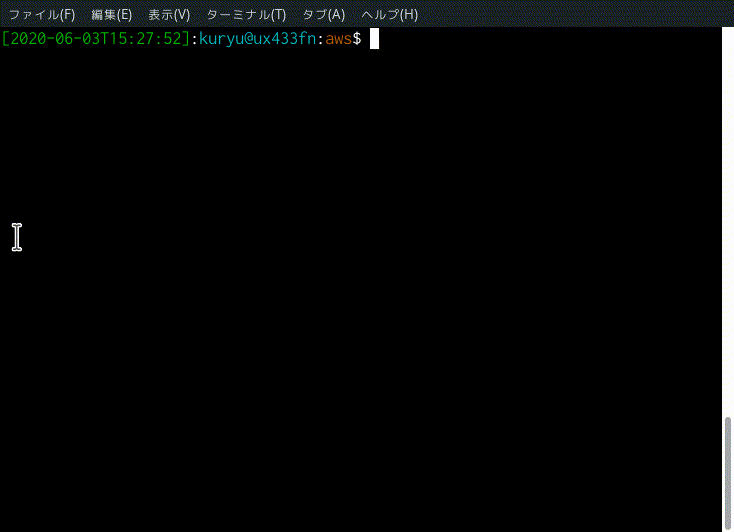

# switch `${AWS_PROFILE}`



## usage

```bash
$ . env.sh
```

then

```
$ awsenv-switch_profile
```


## requirements

* [fzf](https://github.com/junegunn/fzf)
* [envsubst](https://www.gnu.org/software/gettext/manual/html_node/envsubst-Invocation.html)
